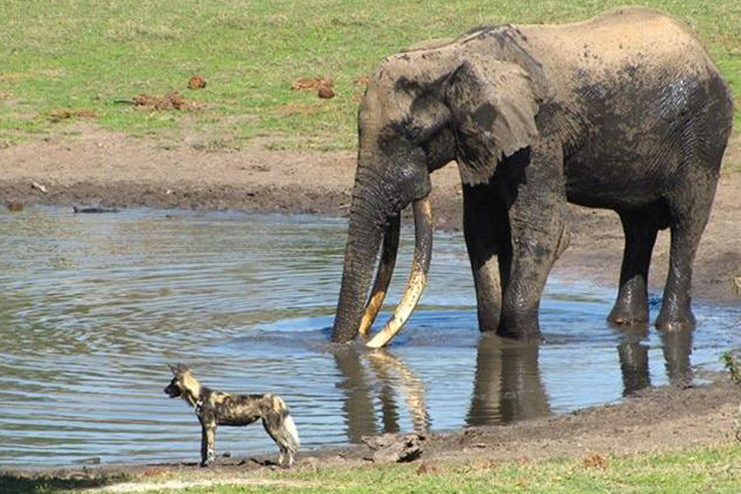

## MMM-ElephantPark-Live

* Live stream from Tembe Elephant Park, situated in KwaZulu-Natal, South Africa.

What you see is what is happening live at the water hole. The web cam runs 24 hours a day. Turn up your speaker volume to hear the sounds of the birds and wildlife.

The Big Five also find their home here – lion, leopard, black and white rhino and buffalo, as well as more than 340 bird species and myriad other animals and plants. It is a world of hot silence and white sand, where the busy modern world ceases to exist and only the rising and setting of the sun marks the passage of time. It is also the ancestral home of the Tembe people.

## Examples
The module is a live stream. These are still shots, obviously.

## Installation

* `git clone https://github.com/mykle1/MMM-ElephantPark-Live` into the `~/MagicMirror/modules` directory.

## Config.js entry and options

    {
    disabled: f,
    module: 'MMM-ElephantPark-Live',
    position: 'top right',
    config: {
        height:"270px",
        width:"480px",
        useHeader: false,                // true if you want a header
        header: "",                      // Change in config file. useHeader must be true
        animationSpeed: 1000,            // fade speed
    }
},
